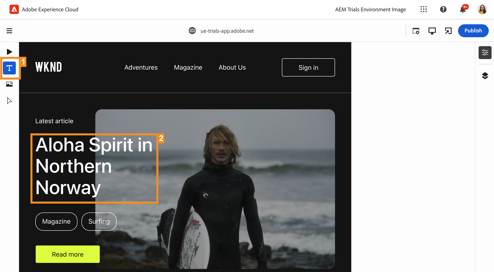

# Modification En Contexte {#editing-in-context}

>[!CONTEXTUALHELP]
>id="aemcloud_sites_trial_edit_inline_universal_editor"
>title="Modification en contexte"
>abstract="Découvrez comment vos applications sans tête peuvent tirer parti de l’éditeur universel pour apporter des modifications en contexte et à faible friction au bout des doigts de vos auteurs."

>[!CONTEXTUALHELP]
>id="aemcloud_sites_trial_edit_inline_universal_editor_guide"
>title="Lancer l’éditeur universel"
>abstract="Dans ce guide, nous allons explorer l’éditeur universel et la manière dont il permet à quiconque de modifier tous les aspects de votre contenu dans n’importe quelle implémentation, ce qui entraîne une vitesse de contenu améliorée.  Lancez ce module dans un nouvel onglet en cliquant ci-dessous, puis suivez ce guide."

>[!CONTEXTUALHELP]
>id="aemcloud_sites_trial_edit_inline_universal_editor_guide_footer"
>title="Dans ce module, vous avez appris à personnaliser du contenu dans le contexte et en place à l’aide d’Universal Editor."
>abstract=""

## Modifier le texte en contexte {#edit-text}

La modification statique et contextuelle peut souvent s’avérer préférable à l’édition de contenu sans affichage structuré, comme dans l’éditeur de fragments de contenu, que vous avez vu dans les modules précédents.

L’éditeur universel vous permet de modifier facilement votre texte en contexte et en place, ce qui vous permet de créer du contenu simple et intuitif.

1. L’éditeur doit se charger par défaut dans **Texte** mode . Si ce n’est pas le cas, appuyez ou cliquez sur le bouton **Texte** dans le rail de mode sur le côté gauche de l’éditeur.

1. Appuyez ou cliquez sur le titre du dernier article pour le modifier.

   

1. Le composant est sélectionné comme indiqué par une bordure bleue avec un onglet indiquant qu’il s’agit d’un composant de texte. Un curseur se trouve dans la bordure en attente de saisie de texte. Remplacez le texte par `Aloha Spirit in Lofoten`.

   

1. Appuyez sur la touche Entrée/Retour ou appuyez ou cliquez en dehors du composant de texte pour que vos modifications soient enregistrées automatiquement.

Universal Editor enregistre automatiquement vos modifications dans l’environnement de création. Vous devez toujours les publier pour que vos lecteurs puissent le voir, ce que nous ferons ultérieurement.

## Expérimenter votre contenu comme vos Readers {#emulators}

L’éditeur universel vous permet d’interagir avec votre contenu dans son contexte, en voyant le contenu tel qu’il est diffusé sur les appareils de vos utilisateurs.

1. Par défaut, l’éditeur effectue le rendu de la version de bureau de votre contenu. Appuyez ou cliquez sur le bouton de l’émulateur en haut à droite de l’éditeur pour modifier l’appareil cible.

   

1. Les Readers peuvent se trouver sur différents appareils avec des proportions différentes. L’éditeur propose donc des modes d’émulation afin de visualiser la présentation de la page aux utilisateurs. Par exemple, sélectionnez l’option Appareil mobile en mode portrait.

   

1. Voir la modification du contenu dans l’éditeur. L’icône de l’émulateur change également pour refléter le mode dans lequel il se trouve. Appuyez ou cliquez n’importe où en dehors du menu de l’émulateur pour le fermer et interagir avec votre contenu.

1. Revenez à l’émulateur en mode bureau.

Vous pouvez également spécifier des dimensions exactes pour l’émulateur et faire pivoter l’appareil émulé afin d’afficher votre contenu sur n’importe quel appareil cible potentiel.

## Prévisualisation et publication {#preview}

Comme vous devez appuyer ou cliquer sur votre contenu pour le sélectionner dans l’éditeur, celui-ci ne vous permet pas de suivre les liens ou d’interagir avec votre contenu en appuyant ou en cliquant dessus lorsqu’il est en mode d’édition. En mode Aperçu, vous pouvez suivre les liens de votre contenu et l’expérimenter comme le feraient vos utilisateurs avant de le publier.

1. Dans le rail de mode sur le côté gauche de l’éditeur, appuyez ou cliquez sur **Aperçu**.

1. Appuyez ou cliquez maintenant sur le bouton **En savoir plus** lien de l’article principal.

   

1. Parcourez l’article, puis utilisez le **Précédent** pour revenir à la page principale.

   

1. Appuyez ou cliquez maintenant sur le bouton **Publier** en haut à droite de l’éditeur pour publier votre contenu.

   

Votre contenu est publié.

## Modification de fragments de contenu {#editing-fragments}

Pour accélérer votre expérience de création de contenu lorsque l’édition structurée de contenu sans tête est plus avantageuse que l’édition statique, l’éditeur universel vous donne également un accès rapide à l’éditeur de fragments de contenu.

1. Faites défiler la page vers le bas jusqu’à l’objet **Aventures** .

1. Dans le rail de mode sur le côté gauche de l’éditeur, sélectionnez **Composants**. Vous pouvez ainsi sélectionner des composants de page dans l’éditeur.

1. Appuyez ou cliquez sur l’une des aventures pour la sélectionner.

   * Notez le contour bleu du composant sélectionné. L’onglet doit se lire comme suit : **reference** lorsqu’un fragment de contenu est sélectionné.
   * Etant donné que l’éditeur universel permet de sélectionner n’importe quel objet de la page, les composants qui font partie d’un fragment de contenu peuvent également être sélectionnés individuellement. Appuyez ou cliquez à l’emplacement indiqué dans l’illustration pour sélectionner l’intégralité du composant Fragment de contenu.

1. Une nouvelle **Modifier** s’affiche sur le rail de mode. Appuyez ou cliquez sur le bouton **Modifier** pour ouvrir l’éditeur de fragment de contenu sur un nouvel onglet.

Dans le nouvel onglet, vous pouvez désormais modifier le fragment de contenu que vous avez sélectionné dans l’éditeur universel.
